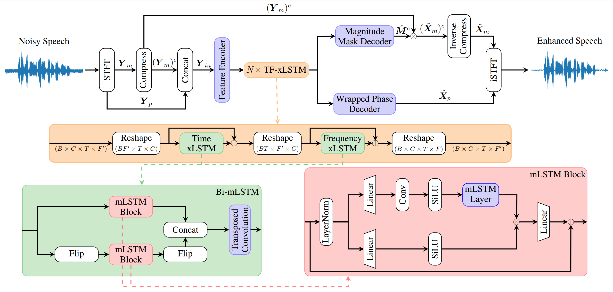
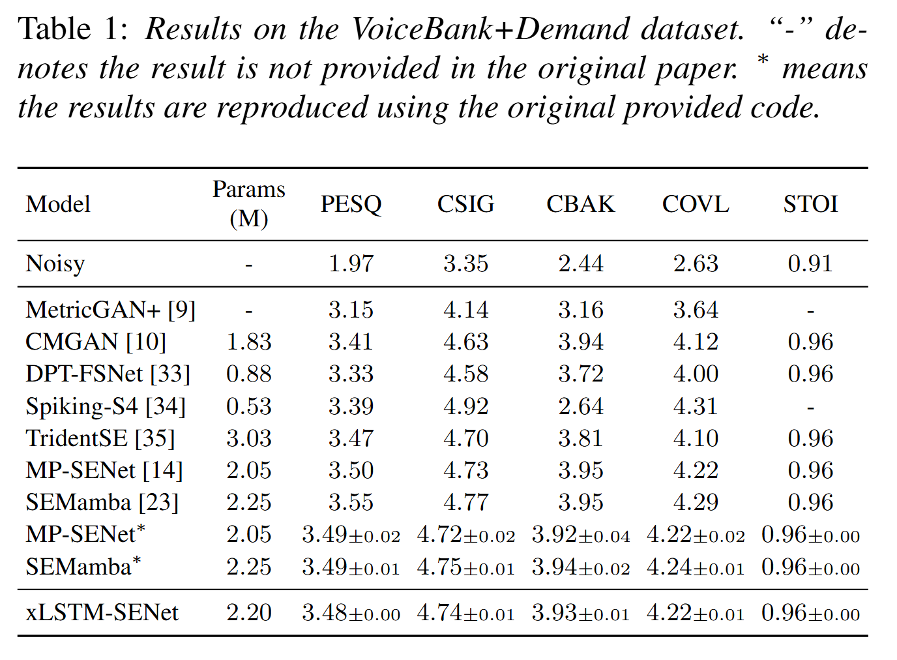
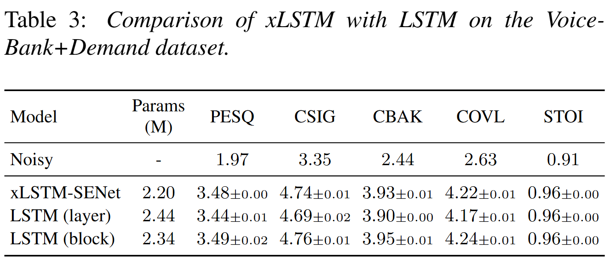
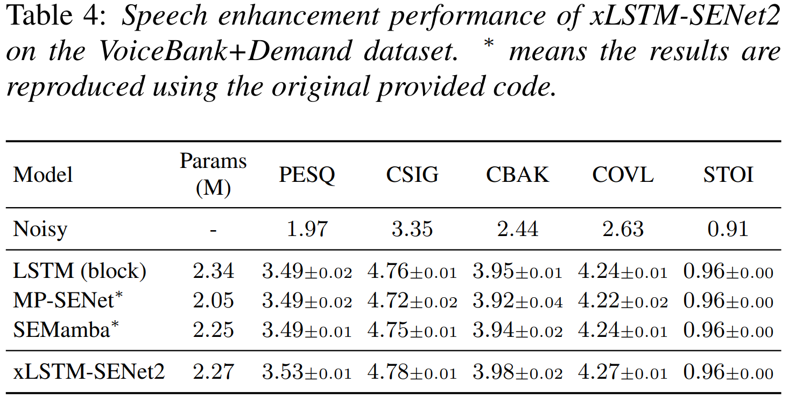

# xLSTM-SENet: xLSTM for Single-Channel Speech Enhancement (Accepted to INTERSPEECH 2025)
This is the official implementation of the [xLSTM-SENet: xLSTM for Single-Channel Speech Enhancement](https://arxiv.org/abs/2501.06146) paper.

---

### Update: Model weights released

[xLSTM-SENet2 Checkpoint](checkpoints/xLSTM_checkpoint.pth) and [xLSTM-SENet2 Recipe](checkpoints/xLSTM_config.yaml) is now available.

Results on VoiceBank+DEMAND:
| PESQ  | CSIG | CBAK  | COVL | SSNR | STOI | ESTOI | SI-SDR |
| ------------- | ------------- |------------- | ------------- |------------- | ------------- |------------- | ------------- |
| 3.521  | 4.770  |3.966  | 4.273  |10.411  | 0.960  |0.891 | 19.629  |


## Requirement
    * Python >= 3.9
    * CUDA >= 12.0
    * PyTorch == 2.2.2

## Model



## Speech Enhancement Results
### Enhancement performance compared to existing methods on the Voicebank+Demand dataset:


### Comparison of xLSTM with LSTM:

In the LSTM (layer) model, we replaced the mLSTM LAYERS in xLSTM-SENet with LSTM. In the LSTM (block) model, we replaced the mLSTM BLOCKS in xLSTM-SENet with LSTM.

### xLSTM-SENet2:

In xLSTM-SENet2, we use 8 layers (instead of 4) and an expansion factor of 2 (instead of 4)


## Installation

### Step 1 - Install PyTorch

Install PyTorch 2.2.2 from the official website. Visit [PyTorch Previous Versions](https://pytorch.org/get-started/previous-versions/) or [For Slurm based systems](https://hub.docker.com/r/pytorch/pytorch/tags)).

### Step 2 - Install Required Packages

After setting up the environment and installing PyTorch, install the required Python packages listed in requirements.txt.

```bash
pip install -r requirements.txt
```

### Step 3 - Install the Mamba Package

Navigate to the mamba_install directory and install the package. This step ensures all necessary components are correctly installed.

```bash
cd mamba_install
pip install .
```

Note: Installing from source (provided `mamba_install`) can help prevent package issues and ensure compatibility between different dependencies. It is recommended to follow these steps carefully to avoid potential conflicts.

## Training the Model

### Step 0: Downsample VoiceBank+Demand Dataset
Using the provided script for [downsampling](https://github.com/NikolaiKyhne/xLSTM-SENet/blob/main/downsampling.py) to downsample the VoiceBank+Demand dataset from 48kHz to 16kHz.

You may need to update the data paths in `downsampling.py`

### Step 1: Prepare Dataset JSON

Create the dataset JSON file using the script `data/make_dataset_json.py`. You may need to modify the data paths in `data/make_dataset_json.py` to match the downsampled dataset. 

Alternatively, you can directly modify the data paths in `data/train_clean.json`, `data/train_noisy.json`, etc.

### Step 2: Run the following command to train the model.

Modify the `--exp_name`, `--exp_folder`, and `--config` parameters in the command to match your folder structure.

```bash
NCCL_P2P_DISABLE=1 torchrun --nnodes=1 --nproc-per-node=4 xLSTM-SENet/train.py --exp_name=seed1234 --exp_folder=results/ --config=xLSTM-SENet/recipes/xLSTM-SENet/xLSTM-SENet_4N.yaml
```

## Running Inference

Modify the `--input_folder` and `--output_folder` parameters to point to your desired input and output directories. Then, run the script.

```bash
NCCL_P2P_DISABLE=1 python xLSTM-SENet/inference.py --input_folder=vctk16/noisy_testset_wav_16k --output_folder=output --checkpoint_file=results/seed1234/g_00xxxxxx.pth --config=xLSTM-SENet/recipes/xLSTM-SENet/xLSTM-SENet_4N.yaml
```

## Evaluation
The evaluation metrics is calculated via: [CMGAN](https://github.com/ruizhecao96/CMGAN/blob/main/src/tools/compute_metrics.py)  


## Citation:
If you find the paper useful in your research, please cite:  
```
@article{kuehne2025xlstmsenet
  title={xLSTM-SENet: xLSTM for Single-Channel Speech Enhancement},
  author={Nikolai Lund Kühne and Jan Østergaard and Jesper Jensen and Zheng-Hua Tan},
  journal={arXiv preprint arXiv:2501.06146},
  year={2025}
}
```

## References and Acknowledgements
We would like to express our gratitude to the authors of [SEMamba](https://github.com/RoyChao19477/SEMamba), [MP-SENet](https://github.com/yxlu-0102/MP-SENet/tree/main), [CMGAN](https://github.com/ruizhecao96/CMGAN), [HiFi-GAN](https://github.com/jik876/hifi-gan/blob/master/train.py), and [NSPP](https://github.com/YangAi520/NSPP).

Additionally, we would like to thank the authors of the original xLSTM and Vision-LSTM papers for their work and codebase. So, please consider citing them as well:
```
@article{xlstm,
  title={xLSTM: Extended Long Short-Term Memory},
  author={Beck, Maximilian and P{\"o}ppel, Korbinian and Spanring, Markus and Auer, Andreas and Prudnikova, Oleksandra and Kopp, Michael and Klambauer, G{\"u}nter and Brandstetter, Johannes and Hochreiter, Sepp},
  journal={arXiv preprint arXiv:2405.04517},
  year={2024}
}


@article{alkin2024visionlstm,
  title={{Vision-LSTM}: {xLSTM} as Generic Vision Backbone},
  author={Benedikt Alkin and Maximilian Beck and Korbinian P{\"o}ppel and Sepp Hochreiter and Johannes Brandstetter},
  journal={arXiv preprint arXiv:2406.04303},
  year={2024}
}
```
